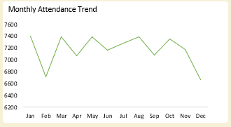
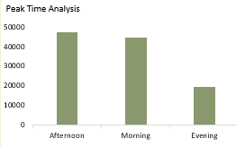
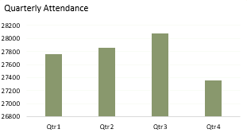
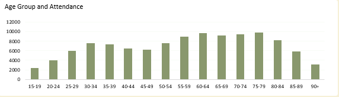
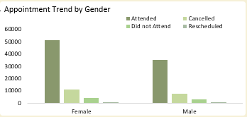

# Appointment Flow and Efficiency Tracker

## Background and Overview
Healthcare facilities frequently experience operational inefficiencies caused by missed appointments, late cancellations, and rescheduling patterns that disrupt clinic capacity planning. This project analyzes **111,488 healthcare appointment records** to evaluate attendance behavior across demographic segments, appointment periods, and scheduling patterns. The dashboard was designed to help hospital administrators understand attendance performance, identify high-risk no-show segments, and optimize scheduling efficiency. By examining attendance status, peak visit times, monthly utilization trends, and demographic attendance behavior, the analysis provides a structured operational perspective on patient engagement and appointment reliability.  

---

## Data Structure Overview
The analysis integrates **three structured datasets**: an appointments dataset containing **111,488 appointment records**, a patients dataset containing demographic attributes such as gender and age group classifications, and a slots dataset defining appointment scheduling periods (morning, afternoon, night). Each row in the primary appointments table represents a scheduled patient encounter, including appointment date, attendance status (attended, cancelled, did not attend, rescheduled/scheduled), and references to patient and slot information. Age groups were categorized from **15–19 through 90+**, enabling demographic segmentation, while time-based fields supported monthly and quarterly attendance analysis. Relationships between appointments, patients, and slots enabled a structured data model that supported KPI calculations, time-based aggregations, and demographic attendance analysis across operational dimensions.  


---

## Technical Stack
Microsoft Excel was used for the full analytical workflow, including data modeling across multiple datasets, pivot table aggregation, calculated fields, and dashboard visualization development.

---

## Executive Summary
The analysis reviewed **111,488 scheduled appointments**, of which **86,032 appointments (77.2%)** were successfully attended, demonstrating generally strong patient engagement. However, operational losses remain significant, with **18,254 cancellations (16.4%)** and **6,615 missed appointments (5.9% no-show rate)** affecting clinic utilization. Attendance volume was highest during **afternoon appointment slots**, accounting for **42,978 attended visits**, compared to **34,388 morning attendances** and **8,666 night visits**, highlighting mid-day operational concentration. Gender distribution showed that **female patients attended 51,096 appointments**, representing approximately **59% of total attendances**, while male patients accounted for **34,936 attended visits**. Quarterly attendance remained relatively stable, with typical quarterly attendance ranging between **2,134 and 2,231 attended visits per quarter** in early reporting periods, indicating consistent operational demand without major seasonal disruptions.  


---

## Insights Deep Dive

Attendance behavior remained operationally stable across months, with monthly attended visits consistently ranging between approximately **660 and 740 completed appointments** during early reporting periods. The absence of extreme spikes or sharp declines suggests steady clinic demand and predictable patient flow, supporting stable workforce scheduling and capacity planning assumptions.  



Peak-time analysis demonstrated that clinic activity was heavily concentrated in afternoon sessions, where **42,978 attended visits** were recorded compared to **34,388 morning attendances** and **8,666 night visits**. Cancellation and no-show patterns followed a similar distribution, indicating that operational congestion and patient availability likely influence appointment outcomes during high-volume time windows.  



Quarterly attendance analysis confirmed consistent service utilization, with attended visits remaining within a narrow operational band across quarters. For example, quarterly attended visits in early reporting periods ranged from **2,134 to 2,231 appointments**, reinforcing the absence of strong seasonal volatility and suggesting predictable service demand across the calendar year.  



Age-group analysis revealed that attendance volume increased steadily through early adulthood into middle-age brackets, with patients aged **30–34 recording 5,810 attended visits** and the **35–39 group recording 5,708 attendances**, significantly higher than the **1,866 attendances recorded among patients aged 15–19**. The trend suggests that healthcare utilization intensifies with age until mid-life before gradually stabilizing, indicating demographic differences in service demand rather than attendance reliability.  



Gender-based appointment analysis showed that female patients accounted for the majority of clinic utilization, with **51,096 attended visits** compared to **34,936 male attendances**. Cancellation and no-show distributions followed similar gender proportions, indicating that attendance disparities were primarily driven by utilization volume rather than behavioral differences between genders.  



---

## Recommendations
Healthcare facilities should prioritize operational resource allocation toward afternoon clinic sessions, where patient demand and attendance volume are highest, to minimize congestion-related delays and cancellations. Appointment reminder systems and rescheduling automation should target the **24.3% combined cancellation and no-show population**, as reducing these losses would significantly improve operational efficiency. Scheduling strategies should incorporate demographic demand patterns, particularly among patients aged **30–39**, who demonstrate the highest utilization volumes and therefore represent the greatest opportunity for workflow optimization. Gender utilization trends indicate that outreach and preventive care campaigns may benefit from targeted engagement strategies toward male patients, who demonstrate lower absolute attendance volumes. Finally, ongoing monthly attendance monitoring should remain integrated into operational dashboards to track attendance improvements and detect emerging scheduling inefficiencies early.
```0
